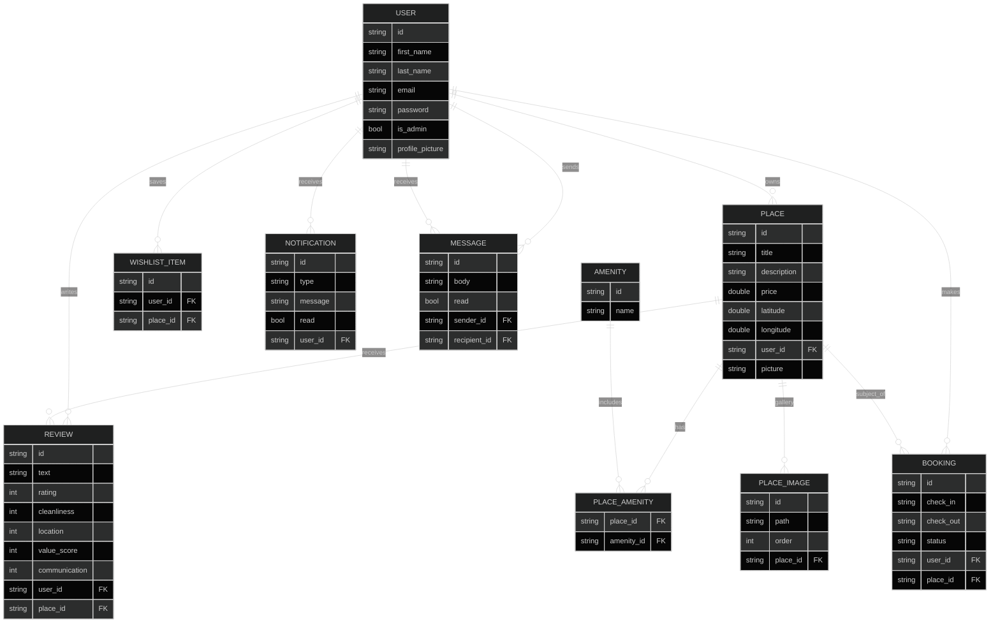

# HBnB — Full-Stack AirBnB Clone

## 🔖 Table of contents

<details>
  <summary>
    CLICK TO ENLARGE 😇
  </summary>
  📄 <a href="#description">Description</a>
  <br>
  📂 <a href="#files-description">Files description</a>
  <br>
  💻 <a href="#installation">Installation</a>
  <br>
  🚀 <a href="#api-endpoints">API Endpoints</a>
  <br>
  🖥️ <a href="#frontend-pages">Frontend Pages</a>
  <br>
  🧪 <a href="#testing">Testing</a>
</details>

## 📄 <span id="description">Description</span>

This project delivers the Part 4 HBnB application: a complete, full-stack AirBnB clone built with a Python/Flask REST API backend and a vanilla HTML/CSS/JavaScript frontend — no framework required.

The backend retains the same layered architecture from Part 3 (Presentation → Facade → Repositories → Persistence) with JWT authentication and SQLAlchemy persistence, and extends it with five new feature domains: **Bookings**, **Wishlists**, **In-app Notifications**, **Direct Messaging**, and **Multiple Place Images**.

The frontend consists of 18 HTML pages served as static files, styled with a warm editorial design system (Lora serif headings, olive `#939d21` brand accent, airy whitespace), and wired to the API entirely with the Fetch API — no jQuery, no build step.

### ✨ Implemented Features

- **Place listings** — filterable by price, amenity, search term, date availability; paginated; wishlist heart on each card
- **Place detail** — hero image gallery with thumbnails, Leaflet/OpenStreetMap interactive map, multi-category review scores with bar visualization, inline booking form
- **Bookings** — create/cancel as guest; confirm/reject as owner; full admin table with delete
- **Wishlist / Saved Places** — heart toggle on listing cards; dedicated saved-places page
- **Messaging** — send/receive direct messages; inbox with Received/Sent tabs; unread badge polling
- **Notifications** — booking and review events trigger in-app notifications; bell icon with unread count; 30-second polling
- **Multi-category reviews** — cleanliness, location, value, communication scores (optional 1–5) alongside the main rating
- **Multiple place images** — cover photo + unlimited extra images; gallery managed from the edit-place page
- **Profile pictures** — avatar upload for users; shown in nav dropdown, review cards, and place-owner tooltips
- **Admin panels** — dedicated pages for managing users, amenities, and all bookings

---

## 📂 <span id="files-description">Files description</span>

| **FILE / DIRECTORY** | **DESCRIPTION** |
| :------------------: | --------------- |
| `app/` | Core Flask application |
| `app/api/v1/` | REST API route modules: `auth`, `users`, `places`, `reviews`, `amenities`, `bookings`, `wishlist`, `notifications`, `messages`, `protected` |
| `app/models/` | SQLAlchemy ORM models: `user`, `place`, `review`, `amenity`, `booking`, `message`, `notification`, `place_image`, `wishlist`, `base_model` |
| `app/services/facade.py` | `HBnBFacade` — single entry point for all API-to-data interactions |
| `app/services/repositories/` | Entity-specific repository classes (8 repositories + abstract base) |
| `app/persistence/repository.py` | Abstract `Repository` base class + `SQLAlchemyRepository` implementation |
| `app/__init__.py` | Flask app factory (`create_app`), namespace registration, schema migrations |
| `frontend/templates/` | 18 HTML pages (see [Frontend Pages](#frontend-pages)) |
| `frontend/static/css/` | Two-level modular CSS: `styles.css` imports 9 feature bundles (`base`, `layout`, `components`, `index`, `place`, `bookings`, `admin`, `profile`, `features`); each bundle imports numbered sub-modules from a matching subdirectory (81 CSS files total) |
| `frontend/static/js/` | `utils.js` (globals/helpers), `auth-dropdown.js` (avatar dropdown keyboard nav + ARIA), `auth.js` (nav visibility, badge polling, session management), and 20 files in `pages/` (17 page modules + 3 render helpers: `index-render.js`, `notifications-view.js`, `inbox-render.js`) |
| `frontend/static/images/` | User avatars, place photos, amenity icons (`icon_wifi.png`, `icon_bed.png`, `icon_bath.png`, `icon_pool.png`, `icon_air-conditioner.png`) |
| `tests/` | 13 test modules covering auth, CRUD, relationships, cascades, validation, notifications, messages, and wishlist |
| `sql/` | `schema.sql` (table definitions), `enter_data.sql` (seed data), `hbnb.db` (SQLite dev database) |
| `config.py` | Flask, JWT, and database configuration (Development / Testing environments) |
| `run.py` | Application entry point |
| `requirements.txt` | Python package dependencies |

---

## 💻 <span id="installation">Installation</span>

1. **Clone the repository:**

```bash
git clone https://github.com/Handroc/holbertonschool-hbnb.git
```

2. **Move into the project directory and install dependencies:**

```bash
cd holbertonschool-hbnb/part4/hbnb
python3 -m venv .venv
source .venv/bin/activate
pip install -r requirements.txt
```

3. **Run the application:**

```bash
python3 run.py
```

4. **Open the application in your browser:**

| URL | Purpose |
|-----|---------|
| `http://127.0.0.1:5000/` | Frontend home page |
| `http://127.0.0.1:5000/api/v1` | API base path |

Default development credentials:

- **Admin email:** `admin@hbnb.io`
- **Admin password:** `admin1234`
- **Database:** `development.db` (SQLite, auto-created on first run)

---

## 🚀 <span id="api-endpoints">API Endpoints</span>

All endpoints are prefixed with `/api/v1`. Swagger UI is available at `http://127.0.0.1:5000/`.

### 0. 🗂️ Project Setup

- Modular `api/`, `models/`, `services/`, `persistence/` directories
- Flask-RESTX initialized with Swagger UI
- Flask-SQLAlchemy with SQLite (development); schema migrations applied via `_apply_migrations()` at startup
- Flask-JWT-Extended protects authenticated endpoints
- Flask-CORS enabled for frontend-backend communication
- Default admin account seeded automatically on first run

---

### 1. 🧠 Business Models

- **BaseModel**: `id` (UUID), `created_at`, `updated_at`
- **User**: `first_name`, `last_name`, `email`, hashed `password`, `is_admin`, `profile_picture`
- **Place**: `title`, `description`, `price`, `latitude`, `longitude`, `picture`, owner, amenities, reviews, images
- **Amenity**: unique `name`
- **Review**: `text`, `rating` (1–5), optional category scores (`cleanliness`, `location`, `value_score`, `communication`), linked to a `User` and a `Place`
- **Booking**: `check_in`, `check_out` (ISO dates), `status` (`pending`/`confirmed`/`cancelled`), linked to a `User` (guest) and a `Place`
- **WishlistItem**: links a `User` to a saved `Place`
- **Notification**: `type`, `message`, `read`, linked to a `User`
- **Message**: `body`, `read`, linked to sender and recipient `User`s
- **PlaceImage**: extra image path, linked to a `Place`



---

### 2. 🔐 Auth Endpoint

| **Method** | **Endpoint** | **Description** |
|:----------:|-------------|-----------------|
| POST | `/api/v1/auth/login` | Login with email + password, returns JWT token |

---

### 3. 👤 User Endpoints

| **Method** | **Endpoint** | **Description** |
|:----------:|-------------|-----------------|
| POST | `/api/v1/users/` | Create a user [admin] |
| GET | `/api/v1/users/` | List all users |
| GET | `/api/v1/users/{id}` | Get user by ID |
| GET | `/api/v1/users/email/{email}` | Get user by email |
| PUT | `/api/v1/users/{id}` | Update user [self or admin] |
| DELETE | `/api/v1/users/{id}` | Delete user [self or admin] |
| POST | `/api/v1/users/{id}/avatar` | Upload profile picture [self or admin] — multipart `avatar` field |
| GET | `/api/v1/users/{id}/places` | List all places owned by user |

Notes:
- Regular users cannot change their own `email` or `is_admin`
- Passwords are never exposed in API responses

---

### 4. 🏷️ Amenity Endpoints

| **Method** | **Endpoint** | **Description** |
|:----------:|-------------|-----------------|
| POST | `/api/v1/amenities/` | Create amenity [admin] |
| GET | `/api/v1/amenities/` | List all amenities |
| GET | `/api/v1/amenities/{id}` | Get amenity by ID |
| PUT | `/api/v1/amenities/{id}` | Update amenity [admin] |
| DELETE | `/api/v1/amenities/{id}` | Delete amenity [admin] |

---

### 5. 🏠 Place Endpoints

| **Method** | **Endpoint** | **Description** |
|:----------:|-------------|-----------------|
| POST | `/api/v1/places/` | Create place [JWT user] |
| GET | `/api/v1/places/` | List all places (supports `?check_in=&check_out=` availability filter) |
| GET | `/api/v1/places/{id}` | Get place by ID — includes owner, amenities, reviews, images, average ratings |
| PUT | `/api/v1/places/{id}` | Update place [owner or admin] |
| DELETE | `/api/v1/places/{id}` | Delete place [owner or admin] |
| POST | `/api/v1/places/{id}/picture` | Upload cover photo [owner or admin] — multipart `picture` field |
| GET | `/api/v1/places/{id}/reviews` | Get all reviews for a place |
| GET | `/api/v1/places/{id}/bookings` | Get bookings for a place [owner or admin] |
| GET | `/api/v1/places/{id}/images` | List extra gallery images |
| POST | `/api/v1/places/{id}/images` | Upload extra image [owner or admin] — multipart `image` field |
| DELETE | `/api/v1/places/{id}/images/{image_id}` | Delete extra image [owner or admin] |

Notes:
- Authenticated user becomes the owner (`owner_id` in payload is ignored)
- All amenity IDs must exist before attachment

---

### 6. 📝 Review Endpoints

| **Method** | **Endpoint** | **Description** |
|:----------:|-------------|-----------------|
| POST | `/api/v1/reviews/` | Create review [JWT user, not place owner] |
| GET | `/api/v1/reviews/` | List all reviews |
| GET | `/api/v1/reviews/{id}` | Get review by ID |
| PUT | `/api/v1/reviews/{id}` | Update review [author or admin] |
| DELETE | `/api/v1/reviews/{id}` | Delete review [author or admin] |

Notes:
- A user cannot review their own place
- One review per user per place (unique constraint)
- Optional category scores: `cleanliness`, `location`, `value_score`, `communication` (each 1–5)

---

### 7. 📅 Booking Endpoints

| **Method** | **Endpoint** | **Description** |
|:----------:|-------------|-----------------|
| POST | `/api/v1/bookings/` | Create booking [JWT user, not place owner] |
| GET | `/api/v1/bookings/` | List bookings [admin: all, user: own] |
| GET | `/api/v1/bookings/{id}` | Get booking [booker, place owner, or admin] |
| PUT | `/api/v1/bookings/{id}` | Update booking [booker: dates+status, owner: status only, admin: all] |
| DELETE | `/api/v1/bookings/{id}` | Delete booking [admin] |

Notes:
- `check_in` and `check_out` must be ISO dates (`YYYY-MM-DD`); check_out after check_in
- Overlapping bookings for the same place are rejected
- Status values: `pending`, `confirmed`, `cancelled`

---

### 8. ❤️ Wishlist Endpoints

| **Method** | **Endpoint** | **Description** |
|:----------:|-------------|-----------------|
| GET | `/api/v1/wishlist/` | Get current user's saved places [JWT] |
| POST | `/api/v1/wishlist/` | Add place to wishlist [JWT] — body: `{place_id}` |
| GET | `/api/v1/wishlist/ids` | Get list of saved place IDs [JWT] |
| DELETE | `/api/v1/wishlist/{place_id}` | Remove place from wishlist [JWT] |

---

### 9. 🔔 Notification Endpoints

| **Method** | **Endpoint** | **Description** |
|:----------:|-------------|-----------------|
| GET | `/api/v1/notifications/` | Get all notifications [JWT] |
| GET | `/api/v1/notifications/unread-count` | Get unread notification count [JWT] |
| PUT | `/api/v1/notifications/{id}/read` | Mark notification as read [JWT, owner] |
| DELETE | `/api/v1/notifications/{id}` | Delete notification [JWT, owner] |

---

### 10. 💬 Message Endpoints

| **Method** | **Endpoint** | **Description** |
|:----------:|-------------|-----------------|
| POST | `/api/v1/messages/` | Send a message [JWT] — body: `{recipient_id, body}` |
| GET | `/api/v1/messages/inbox` | Get received messages [JWT] |
| GET | `/api/v1/messages/sent` | Get sent messages [JWT] |
| GET | `/api/v1/messages/unread-count` | Get unread message count [JWT] |
| GET | `/api/v1/messages/conversation/{uid}` | Get conversation thread with a user [JWT] |
| PUT | `/api/v1/messages/{id}/read` | Mark message as read [JWT, recipient] |
| DELETE | `/api/v1/messages/{id}` | Delete message [JWT, sender or recipient] |

---

## 🖥️ <span id="frontend-pages">Frontend Pages</span>

All pages are served as static HTML files from `frontend/templates/`. They load `utils.js` and `auth.js` for shared utilities and nav management, plus a page-specific module from `frontend/static/js/pages/`.

| **Page** | **File** | **Access** | **Description** |
|----------|----------|:----------:|-----------------|
| Home / Place Listing | `index.html` | Public | Place cards (editorial asymmetric grid — wide viewport: every 5th card spans 2 columns) with price/amenity/search/date filters, active-filter pills, wishlist hearts, pagination |
| Place Detail | `place.html` | Public | Hero gallery, Leaflet map, multi-category review scores, inline booking + review forms |
| Login | `login.html` | Public | JWT login form with redirect |
| Public Profile | `user_profile.html` | Public | Another user's profile — avatar, bio, listed places, message button |
| My Profile | `profile.html` | Auth | Edit own profile info and upload avatar |
| Add Place | `add_place.html` | Auth | Create a new place listing with amenities and cover photo |
| Edit Place | `edit_place.html` | Owner/Admin | Pre-populated form to update place details; manage extra gallery images |
| Add Review | `add_review.html` | Auth | Standalone review form with category score sliders |
| My Places | `my_places.html` | Auth | Owner dashboard — list, edit, view bookings for, or delete own places |
| My Bookings | `my_bookings.html` | Auth | All bookings made by the logged-in user; status badges; cancel button |
| Manage Bookings | `manage_bookings.html` | Owner | Bookings for a specific place (`?id=<place_id>`); Confirm / Reject buttons |
| Saved Places | `saved_places.html` | Auth | Wishlist — all saved places with Remove buttons |
| Inbox | `inbox.html` | Auth | Messaging inbox with Received / Sent tabs; reply and compose panels; unread badge |
| Notifications | `notifications.html` | Auth | In-app notification feed; mark-read and delete per item; mark-all-read button |
| Admin Hub | `admin.html` | Admin | Landing page linking to Users, Amenities, and Bookings admin panels |
| Admin Users | `admin_users.html` | Admin | User table with real-time search, edit link (→ `profile.html?id=<userId>`), delete, and create-user form |
| Admin Amenities | `admin_amenities.html` | Admin | Amenity table with inline edit and delete |
| Admin Bookings | `admin_bookings.html` | Admin | All bookings table with delete |

### Nav Visibility

Nav links are conditionally shown by `auth.js` based on login state and admin role:

- **Always visible:** Login (logged out) / Logout (logged in)
- **Logged in only:** Profile, My Places, Add Place, Saved Places (heart icon), Inbox (badge), Notification bell (badge)
- **Admin only:** Admin link (→ `admin.html`)

---

## 🧪 <span id="testing">Testing</span>

### 📦 Project Structure (Testing)

```text
holbertonschool-hbnb/
└── part4/
    └── hbnb/
        ├── app/
        ├── tests/
        │   ├── __init__.py
        │   ├── helpers.py
        │   ├── test_auth.py
        │   ├── test_users.py
        │   ├── test_amenities.py
        │   ├── test_places.py
        │   ├── test_reviews.py
        │   ├── test_bookings.py
        │   ├── test_notifications.py
        │   ├── test_messages.py
        │   ├── test_wishlist.py
        │   ├── test_relationships.py
        │   ├── test_protected.py
        │   ├── test_payload_and_validation.py
        │   └── test_cascading_deletes.py
        ├── config.py
        ├── requirements.txt
        └── run.py
```

The `helpers.py` module provides an `APITestCase` base class that spins up an in-memory SQLite database for each test run, keeping tests fully isolated from the development database.

### ✅ Run All Tests

Activate the virtual environment, then:

```bash
cd holbertonschool-hbnb/part4/hbnb
python3 -m unittest discover tests
```

Expected result:

```text
Ran 52 tests in ...

OK
```

### 🚀 Start the Flask API Server

```bash
cd holbertonschool-hbnb/part4/hbnb
python3 run.py
```

Server runs at `http://127.0.0.1:5000`. Swagger UI is at `http://127.0.0.1:5000/`.

### 🧪 Manual Testing with curl

#### 0️⃣ Authenticate as admin

```bash
curl -X POST http://127.0.0.1:5000/api/v1/auth/login \
  -H "Content-Type: application/json" \
  -d '{"email": "admin@hbnb.io", "password": "admin1234"}'
```

#### 1️⃣ Create a User

```bash
curl -X POST http://127.0.0.1:5000/api/v1/users/ \
  -H "Content-Type: application/json" \
  -H "Authorization: Bearer ADMIN_TOKEN" \
  -d '{
    "first_name": "Claire",
    "last_name": "Obscure",
    "email": "claire@example.com",
    "password": "Secret123!"
  }'
```

Then log in as that user:

```bash
curl -X POST http://127.0.0.1:5000/api/v1/auth/login \
  -H "Content-Type: application/json" \
  -d '{"email": "claire@example.com", "password": "Secret123!"}'
```

#### 2️⃣ Create an Amenity

```bash
curl -X POST http://127.0.0.1:5000/api/v1/amenities/ \
  -H "Content-Type: application/json" \
  -H "Authorization: Bearer ADMIN_TOKEN" \
  -d '{"name": "WiFi"}'
```

#### 3️⃣ Create a Place

```bash
curl -X POST http://127.0.0.1:5000/api/v1/places/ \
  -H "Content-Type: application/json" \
  -H "Authorization: Bearer USER_TOKEN" \
  -d '{
    "title": "Charming Loft",
    "description": "A cozy loft in the city center",
    "price": 120.5,
    "latitude": 48.8566,
    "longitude": 2.3522,
    "amenities": ["AMENITY_ID"]
  }'
```

#### 4️⃣ Create a Booking

```bash
curl -X POST http://127.0.0.1:5000/api/v1/bookings/ \
  -H "Content-Type: application/json" \
  -H "Authorization: Bearer REVIEWER_TOKEN" \
  -d '{
    "place_id": "PLACE_ID",
    "check_in": "2026-05-01",
    "check_out": "2026-05-05"
  }'
```

#### 5️⃣ Create a Review

```bash
curl -X POST http://127.0.0.1:5000/api/v1/reviews/ \
  -H "Content-Type: application/json" \
  -H "Authorization: Bearer REVIEWER_TOKEN" \
  -d '{
    "text": "Great location and clean space!",
    "rating": 5,
    "cleanliness": 5,
    "location": 5,
    "value_score": 4,
    "communication": 5,
    "place_id": "PLACE_ID"
  }'
```

### ✅ Testing Summary

| **Test Type** | **Description** | **Command / URL** |
|:-------------:|----------------|-------------------|
| Unit Tests | Python unittest suite (52 tests) | `python3 -m unittest discover tests` |
| Manual API Test | Authenticated `curl` requests against a running server | `curl -X ...` |
| API Documentation | Swagger UI auto-generated by Flask-RESTX | `http://127.0.0.1:5000/` |
